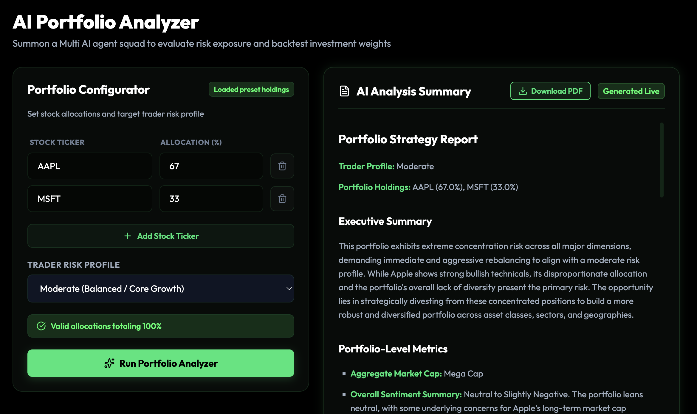
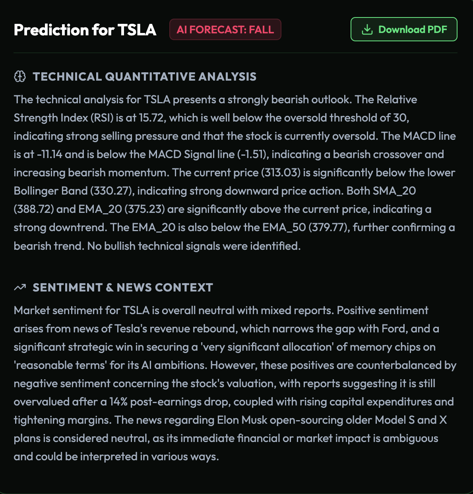
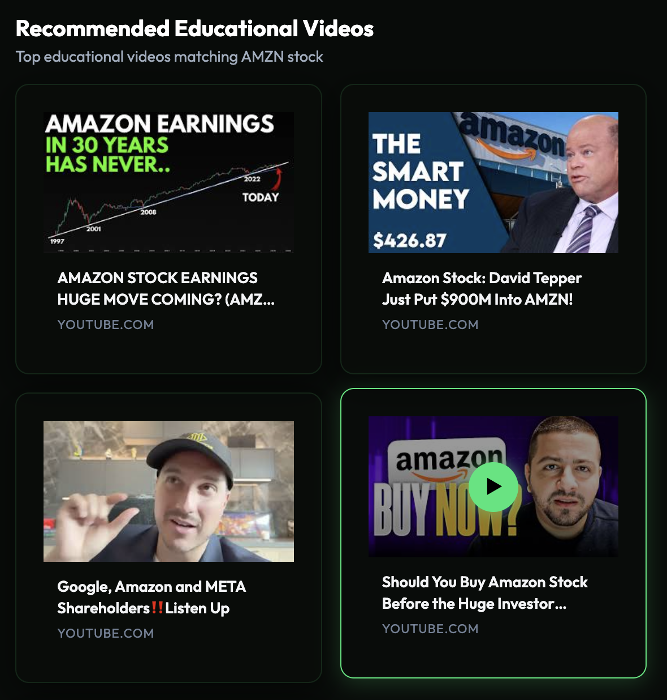
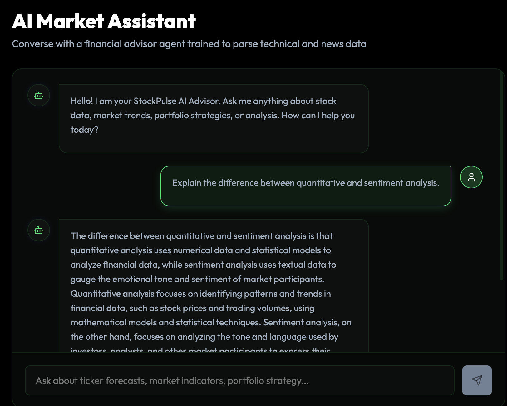
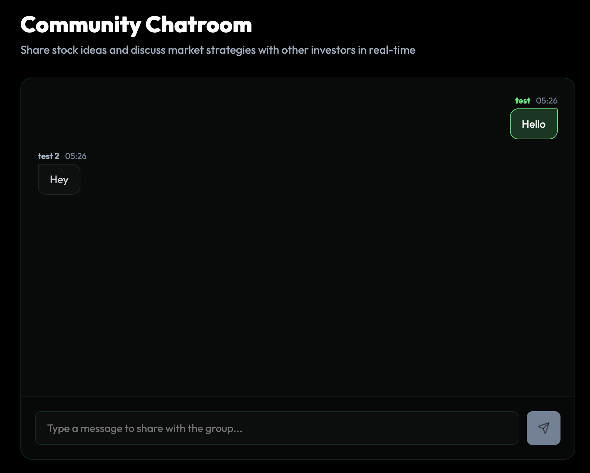
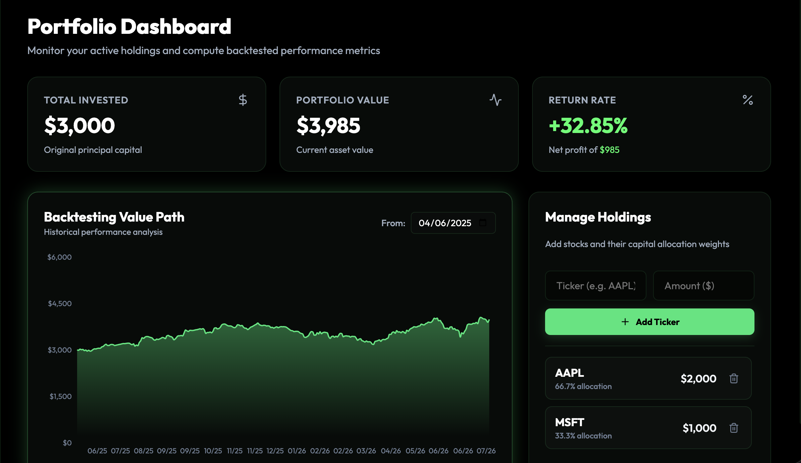

# 📈 StockPulse

StockPulse is an AI-powered market analysis platform that helps users analyze portfolios, explore market trends, and make informed investment decisions through interactive tools and real-time insights.

---

## Core Features

### 1. AI Portfolio Analyzer

* Assesss portfolio allocations across multiple risk profiles (*Conservative, Moderate, Aggressive, Speculative,* and *Hedged*).
* Automatically validates portfolio weights and highlights potential risk exposures.
* Export detailed portfolio analysis as a PDF report.

  

### 2. Market Trends & Forecasts

* Explore top-performing stocks and market trends across multiple time periods.
* Receive AI-generated forecasts with supporting market analysis (*RISE, FALL,* or *STABLE*).

  

### 3. Financial Video Explorer

* Search for investment tutorials and market updates independently of the analysis dashboard.
* Browse results in a clean, thumbnail-based video gallery.

  

### 4. AI Financial Assistant

* Ask finance-related questions through a context-aware chat assistant.
* Use quick prompts for common portfolio and investment queries.

  

### 5. Community Forum

* Join live discussions with other investors through a real-time chat feed.
* View connection status with automatic reconnection support.

  

### 6. Portfolio Backtesting

* Add, edit, and manage portfolio holdings with ease.
* Compare historical portfolio performance using a customizable start date using buy-and-hold, fixed-weight strategy.

  

## Tech Stack

* **Frontend:** Next.js
* **Backend:** Django REST Framework
* **Database:** PostgreSQL
* **AI/ML:** CrewAI
* **Data:** FinnHub API, yFinance, youtube-search

## Contributors

- [Armaan Jagirdar](https://github.com/Armaan457)
- [Lakshay Sawhney](https://github.com/lakshaysawhney)
- [Yajat Pahuja](https://github.com/yajatpahuja) 
- [Himanish Puri](https://github.com/himanishpuri)